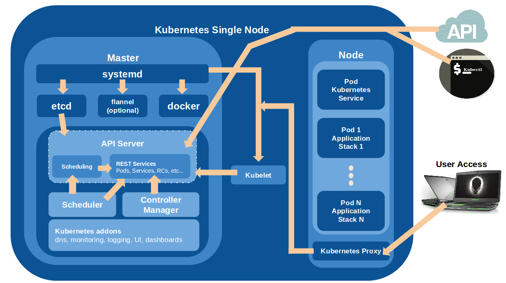
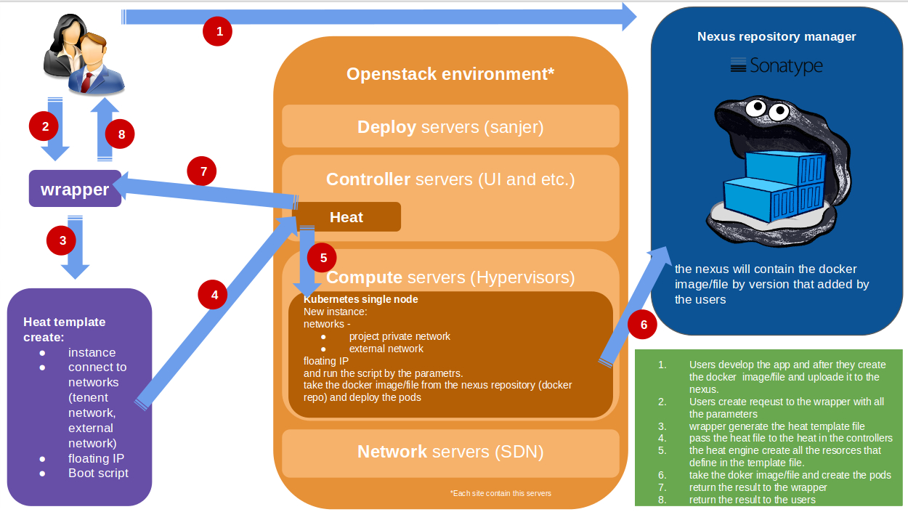

# Kubernetes-Single-Node

**Ansible Deploy By** :  
 - Nissim Bitan
 - Niv Azriel 

## To Run:

### without flannel 
cd scripts/ && ./deploy-local-cluster.sh

### with flannel
cd script/ && ./deploy-cluster.sh

**Tips:**
in local cluser (single node) you dont need flannel

# Kubernetes single node architecture

# The deploy process

